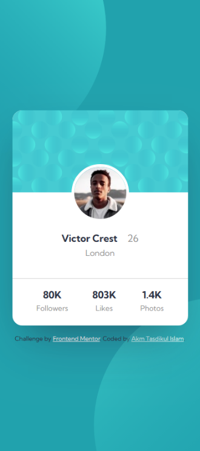

# Frontend Mentor - Profile card component solution

This is a solution to the [Profile card component challenge on Frontend Mentor](https://www.frontendmentor.io/challenges/profile-card-component-cfArpWshJ). Frontend Mentor challenges help you improve your coding skills by building realistic projects.

## Table of contents

- [Overview](#overview)
  - [The challenge](#the-challenge)
  - [Screenshot](#screenshot)
  - [Links](#links)
- [My process](#my-process)
  - [Built with](#built-with)
  - [What I learned](#what-i-learned)
- [Author](#author)

## Overview

Project Started: 10 Jan 2024 Project Ended: 11 Jan 2024 Project Duration: 01 Days

### The challenge

- Build out the project to the designs provided

### Screenshot



### Links

- [Solution URL:](https://github.com/akmtasdikulislam/profile-card-component)
- [Live Site URL:](https://akmtasdikulislam.github.io/profile-card-component/)

## My process

- At first I linked `style.css` file and Google Fonts with `index.html`. Then added the color guides and initialized the `css` file.

```css
:root {
  /* Primary Colors */
  --dark-cyan: hsl(185, 75%, 39%);
  --dark-desaturated-blue: hsl(229, 23%, 23%);
  --dark-grayish-blue: hsl(227, 10%, 46%);
  /* Neutral Colors */
  --dark-grey: hsl(0, 0%, 59%);
  /* Initail font-size */
  font-size: 18px;
}

/* Initalization */
*,
::before,
::after {
  box-sizing: border-box;
  font-family: "Kumbh Sans", sans-serif;
  margin: 0;
  padding: 0;
}
```

- After then, added necessary `HTML` code to implement the profile card and after doing this, I added necessary `css` styles to match the design sample.
- Then I added the _background circles_ and wrote necessary `css` styles to match with the design sample.
- Finally I added necessary css `@media-query` rules to follow the mobile-version UI design sample.

### Built with

- Semantic HTML5 markup
- CSS custom properties
- Flexbox

### What I learned

By doing this project, first of all I learned how to add multiple circles as background and also position it.

## Author

- Website - [Akm Tasdikul Islam](https://www.frontendmentor.io/profile/akmtasdikulislam)
- Frontend Mentor - [@akmtasdikulislam](https://www.frontendmentor.io/profile/akmtasdikulislam)
